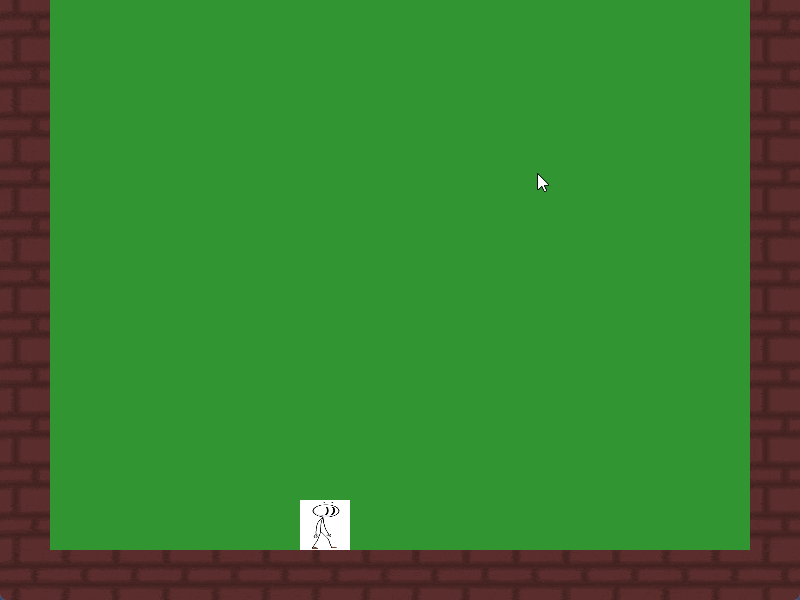

# Albin-Kron-Portfolio
A portfolio containing things I have worked on
# Games
## [REGAUGE](https://github.com/Alkr04/Albin-Kron-Portfolio/blob/main/REGAUGE/READEME.md) <--- click here to see more

### Game description

REGAUGE is a fast paced multiplayer PvP game about defeating your friends in the arena. The game contains a diverse arsenal of weapons ranging from standard pistols, shotguns and an uncontrollable automatic rifle that broke its chains.

### Project info

Role: System Programmer

Duration: 04/2025 - 06/2025

Engine: Unity

Genre: Couch Co-op, Shooter

Team: 3 Programers, 4 Artists

[itch.io page](https://yrgo-game-creator.itch.io/regauge)

<table>
  <tr>
    <td></td>
    <td></td>
  </tr>
</table>

## [Shellscape](https://github.com/Alkr04/Albin-Kron-Portfolio/blob/main/Shellscape/README.md) <--- click here to see more

### Game description

One on one battle against the shrimp who punches with the force of a bullet. Hit his weak point to stun him and huck him before slicing him to pieces. Beat him and win the sushi price or die in disgrace.

### Project info

Role: Enemy Programmer

Duration: 11/2024 - 01/2025

Engine: Unity

Genre: First Person Shoter

Team: 3 Programers, 3 Artists

[itch.io page](https://yrgo-game-creator.itch.io/shellscape)

<table>
  <tr>
    <td></td>
    <td></td>
  </tr>
</table>

## Unamed SDL3 Test

### Game description

A simple test game to learn a bit of C++ and SDL3. The knowledge gained from it will be used for my upcoming graduation project.

### Project info

Role: Programmer

Duration: 18/08/2025 - 22/08/2025

Framework: SDL3

Team: 1 programer

<table>
  <tr>
    <td></td>
    <td></td>
  </tr>
</table>

## Blade and Horde

### Game description

A simple horde survival game. survive for as long as you can with only a sword and 50 shotgun shells.

### Project info

Role: Programmer

Duration: 03/2025 - 04/2025

Engine: Unreal engine 5

Genre: First Person, Horde Survival

Team: 1 programer

<table>
  <tr>
    
  </tr>
</table>

## Robomania

### Game description

A simple platformer inspired by hollow knight. Save your creator or drown in oil.

### Project info

Role: General Programmer

Duration: 01/2024 - 06/2024

Engine: Unity

Genre: Platformer

Team: 1 Programer, 1 Artist

<table>
  <tr>
    <td></td>
    <td></td>
  </tr>
</table>
