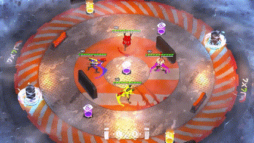

# REGAUGE

System Programer

Duration: 04/2025 - 06/2025

Engine: Unity

Genre: Couch Co-op, Shooter

Team: 3 Programers, 4 Artists

<table>
  <tr>
    <td></td>
    <td></td>
  </tr>
</table>

## My contribution

### Weapon and bullet system

I was the primary developer behind the weapon system. 

The game was originaly pitched as a grid based 2 player turn based Party/Strategy game whit plenty of weapons. originaly I was drawn in by the turn and grid based idea of the game but those Ideas were discarded shortly before proper development began do to being to complex and time consuming. But during the designe meatings we also expanded a bit on the idea of multeple weapons whitch ended up capturing my imagination. So while we were still consepting the game I was also starting to imagine how the game culd have multeple weapons whitout spending to much time on each indevidual weapon.

half a year before that one frend recomended that I shuld lern scripteble objects do to how usefull they are. And I tested them out on a project and foud them to be realy good for creating diferent setings for the same script. Thus when I was planing how the wapon system was going to work I quicly concluded that scripteble objects were going to be a good fit. so I created one gun script that holds all the functions for the gun. and a scripteble object for the gun's setings.

When a weapon is picked up the gun gets the scripteble object that weapon uses and reads it and adds all the functions it uses into an event. When fiering it first checs whitch fire mode it uses then it runs the events.

Bullets work in a similar maner exept it has 3 seperet events. One when it is fired, one during fligth and one when it hits some thing. 

Acording to the other team members it was easy to create and edit weapons and bullets.

<table>
  <trt>
    <td></td>
    <td><td>
  </trt>
</table>

### My other contributions

* the doors

* the bullet pools

* the audio system 
